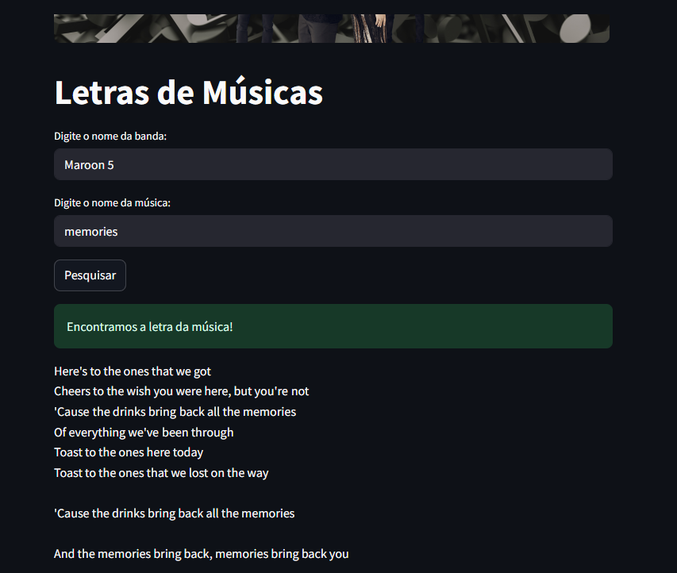

## Seja Bem vindo no meu novo Projeto

## Tecnologias Utilizadas

Este projeto foi construído utilizando as seguintes ferramentas e tecnologias:

* Python 3.7+
* Streamlit
* requests
* Poetry (para gerenciamento de dependências)
* Git (para controle de versão)
* API Lyrics.ovh (para buscar letras de músicas)




# Letras de Músicas com Streamlit

## Como Usar

Siga estes passos para configurar e executar o aplicativo localmente:

1.  **Obtenha o código (Clone o repositório):**

    ```bash
    git clone [https://github.com/SeuUsuario/seu-repositorio.git](https://github.com/SeuUsuario/seu-repositorio.git)  # Baixa o código do GitHub (substitua a URL)
    cd seu-repositorio  # Entra na pasta do projeto
    ```

2.  **Instale as dependências usando Poetry:**

    * Certifique-se de que você tem o Poetry instalado no seu sistema. Se não tiver, você precisará instalá-lo primeiro. Você pode encontrar instruções de instalação no site oficial do Poetry: [https://python-poetry.org/](https://python-poetry.org/)
    * O Poetry usará o arquivo `pyproject.toml` para gerenciar as dependências e o ambiente virtual do projeto.
    * Execute o seguinte comando:

        ```bash
        poetry install  # Instala as dependências usando Poetry
        ```

        * Este comando irá:
            * Criar um ambiente virtual (se ainda não existir). O Poetry escolhe um local padrão para o ambiente virtual, a menos que você o configure de forma diferente.
            * Instalar as dependências especificadas no arquivo `pyproject.toml`.
            * Atualizar o arquivo `poetry.lock` para garantir versões consistentes das dependências.

3.  **Ative o ambiente virtual (se necessário):**

    * Em muitos casos, o Poetry executa comandos dentro do ambiente virtual automaticamente. No entanto, se você precisar executar comandos diretamente no ambiente virtual (por exemplo, para executar o Streamlit), você pode ativá-lo.
    * Para encontrar o local exato do ambiente virtual criado pelo Poetry, você pode usar o seguinte comando:

        ```bash
        poetry env info --path
        ```

        * Este comando fornecerá o caminho completo para o diretório do ambiente virtual.
    * Depois de obter o caminho, você pode ativar o ambiente virtual da mesma forma que faria com um ambiente virtual criado com `venv`:
        * **No Linux ou macOS:**

            ```bash
            source <caminho_do_ambiente_virtual>/bin/activate
            ```

        * **No Windows:**

            ```bash
            <caminho_do_ambiente_virtual>\Scripts\activate
            ```

        * Substitua `<caminho_do_ambiente_virtual>` pelo caminho obtido com `poetry env info --path`.

4.  **Execute o aplicativo Streamlit:**

    * Se você ativou o ambiente virtual no passo 3, você pode executar o aplicativo Streamlit diretamente:

        ```bash
        streamlit run app.py  # Inicia o aplicativo Streamlit
        ```

    * Alternativamente, o Poetry fornece o comando `poetry run` para executar comandos dentro do ambiente virtual sem ativá-lo explicitamente:

        ```bash
        poetry run streamlit run app.py
        ```

5.  **Abra no navegador:**

    * O aplicativo estará disponível em `http://localhost:8501` (ou um endereço similar).
